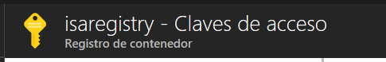
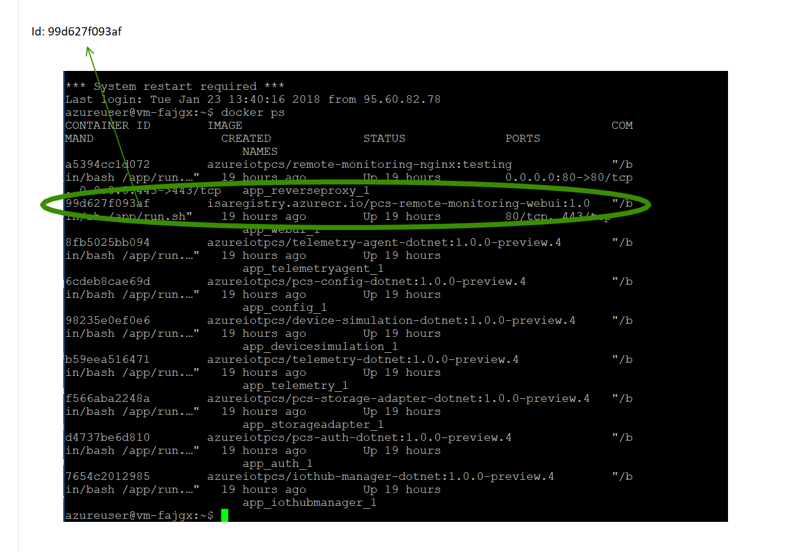

# Docker (for dummies) for Remote Monitoring V2
## Publishing your own code/changes

### Customizing the (UI) solution 
(seed: https://docs.microsoft.com/en-us/azure/iot-suite/iot-suite-remote-monitoring-customize)

1. <b> Clone the github repository </b>

    	git clone https://github.com/Azure/pcs-remote-monitoring-webui.git
	
	Note: If you use the PREVIEW template, clone the branch 1.0.0-preview.4	

        git clone -b <branch> --single-branch <url>

2. <b> Change something (just for test) </b>

	○ For example, in   src/common/lang.js write   CONTOSO: 'YourCompanyName' 
	
    ○ And change the logo: add it in "assets/icons" and edit the file: src/components/layout/leftNav/leftNav.js, change the line
		
        import ContosoIcon from '../../../assets/icons/Contoso.svg';

3. <b> Try it! </b>

You can try it in your machine, with this instructions: 
https://github.com/Azure/pcs-remote-monitoring-webui/blob/master/README.md#build-run-and-test-locally   

Or directly in Azure. <b> with Docker </b>

4. If you don't have Docker for Windows, install Docker:

https://store.docker.com/editions/community/docker-ce-desktop-windows 

5. <b> Build </b>

        .\build.cmd

       

6. <b> Run </b>        

        run.cmd testing

Now go to your browser: 

YEY!!!

7. <b> Publish </b>

	But first....
	
	- Create a registry in your Azure account: Azure Container Registry
	- Name without capital letters
	- Enable administrator user

        	docker login  server -u user -p password

And now yes… publish in the registry!!

- Tag the build

- And push….

8. Access to the VM where the Remote Monitoring v2 is.

9. Download the "image" from your Azure Container Registry and DEPLOY it.

Open this file and change some things:

<b>Change:</b> in the file:
- "isaregistry.azurecr.io" (put your registry, not mine! ;)) change also de tag (I put 2.0, not 1.0)

Exit and save.

Now, login in your azure container registry. 
Like that:

        > sudo ./start.h

    - This step download and deploy the image of the container that we had in our azure container registry 

Check it with 

        > docker ps

And see the results:

