# IoT Hub -> Azure Functions

## Scenario or premise
I have an **IoT Hub** and I want to connect it with an **Azure Function**

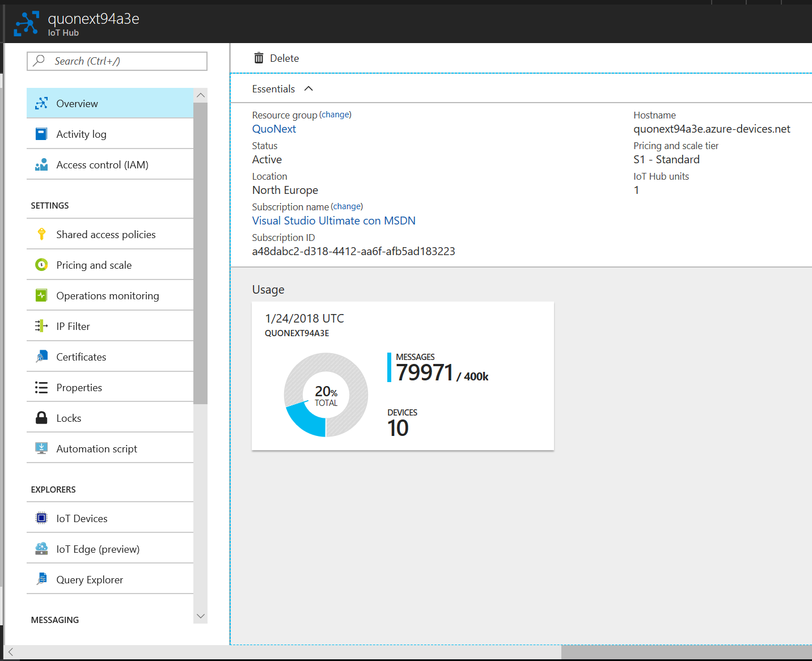

*Note: a good practice for facilitate the correct scalation -> Create a new  and its own consumer group*

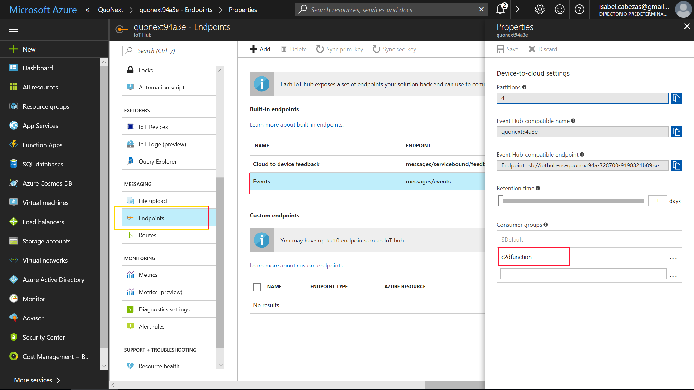

Here, copy the connection string (because you will use it later)
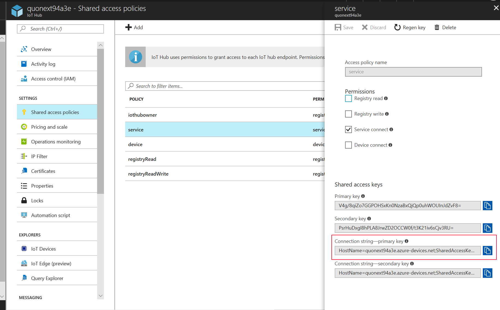

1. Let's **create a Azure function App:**

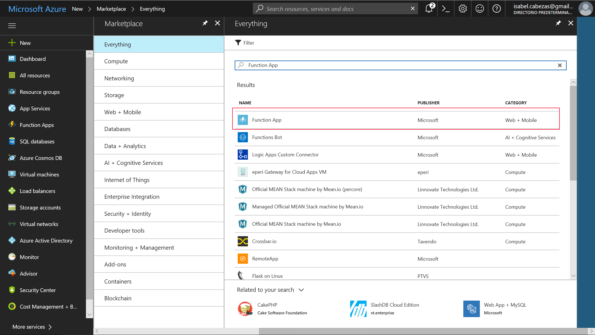

Write a name, use a existing Resource Group or a create a new one… And create a new storage:

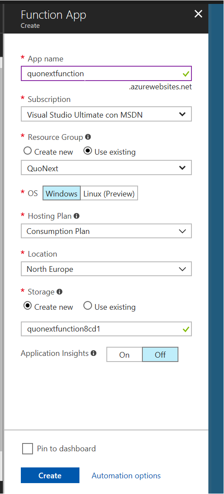

Click in "+" icon (blue):

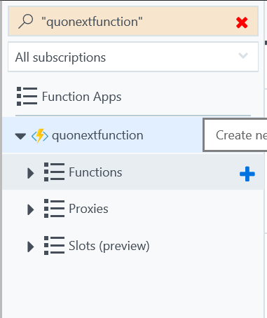

Click in the link "Custom function":

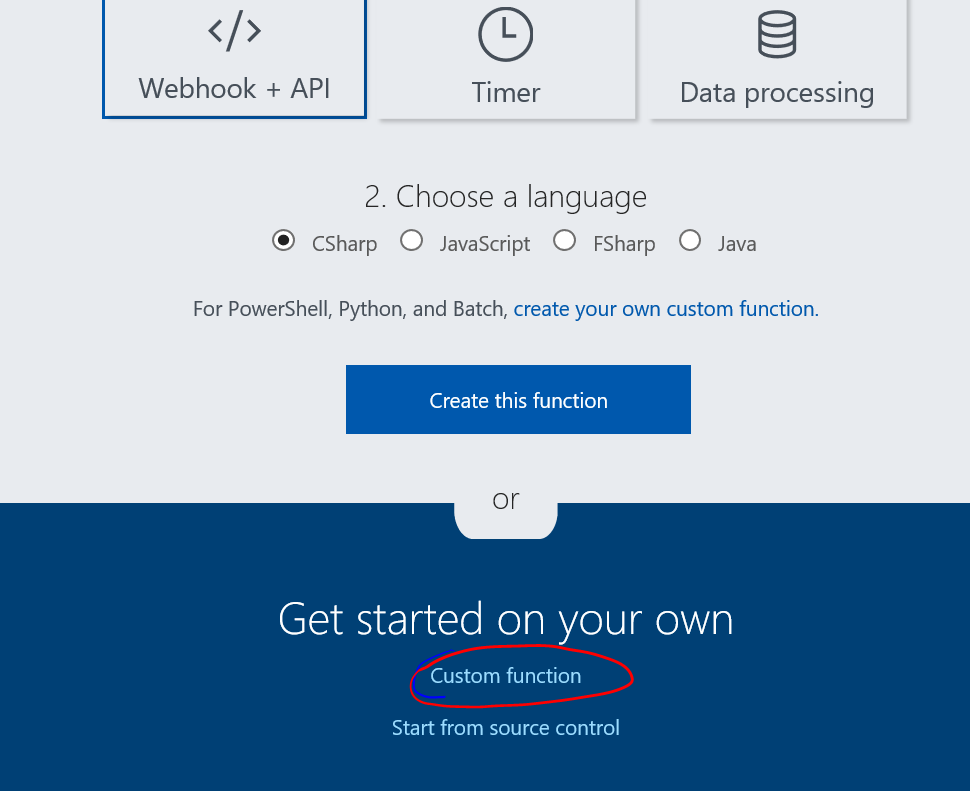

Choose the IoT Hub  (Event Hub) as the service that delivers messages to the Azure Function, and select the language (C# in my case):

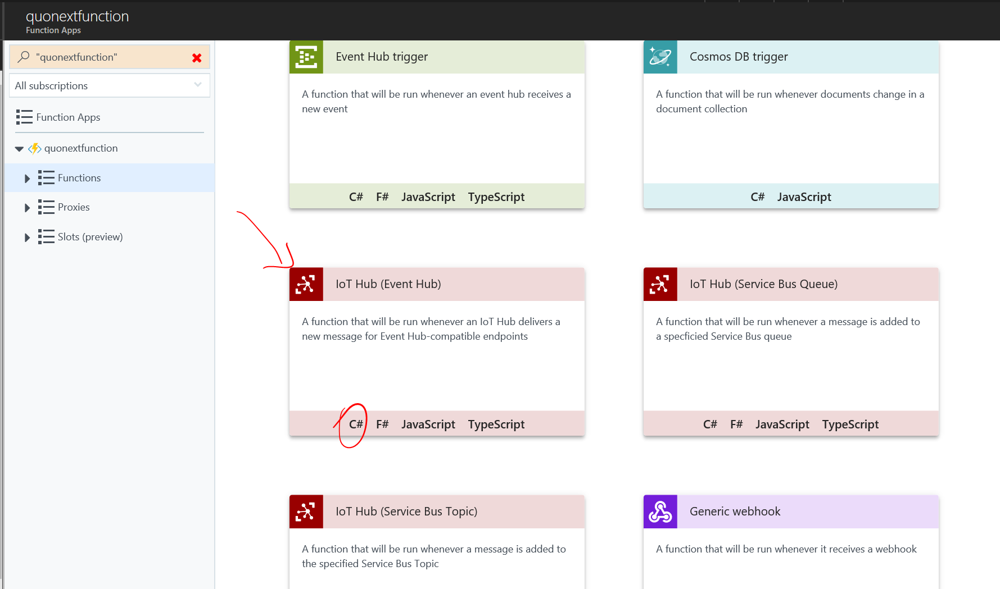

Write a name and create a NEW event hub connection:

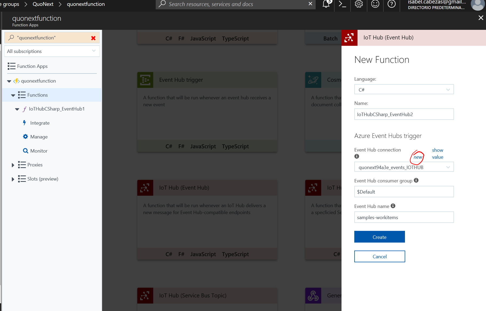

Select the IoT Hub:

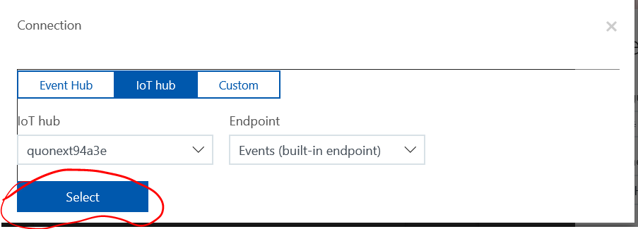

2. **Add an application settings with the IoT Hub Connection String**

And when is already created… Click in "Application Settings":
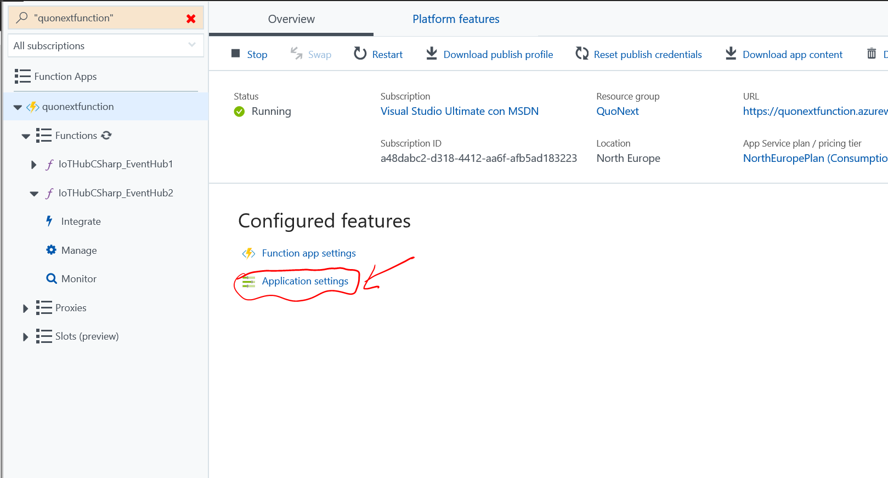

We are going to add a setting with the Connection String of the IoT Hub.
I named this seeting iothubc2d (IoT Hub Cloud to Device) but, of course, you can name it how you want:
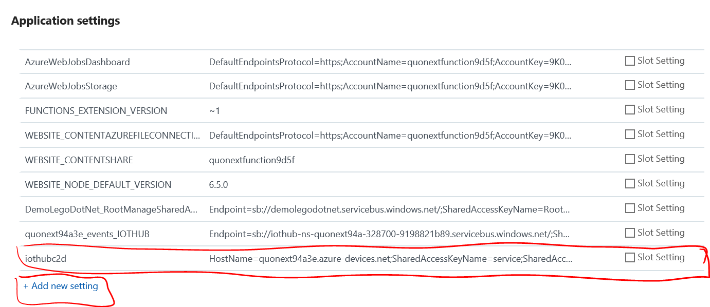

3. Write the Azure Function's **code**
Here is the code of the Azure Function.

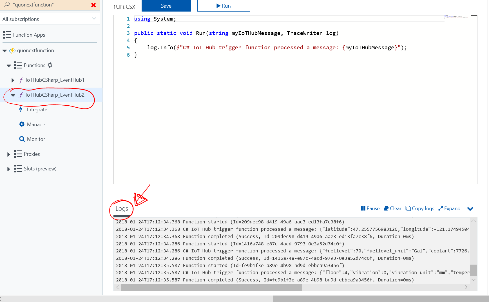

You can see in the "Logs" section if your Azure Function is receiving some data from the IoT Hub. 

4. **Problems?**
### If you DON'T SEE ANY DATA, try this.

If you don't see any data, probably the IoT Hub is not connected correctly.

Create a new Event Hub connection:

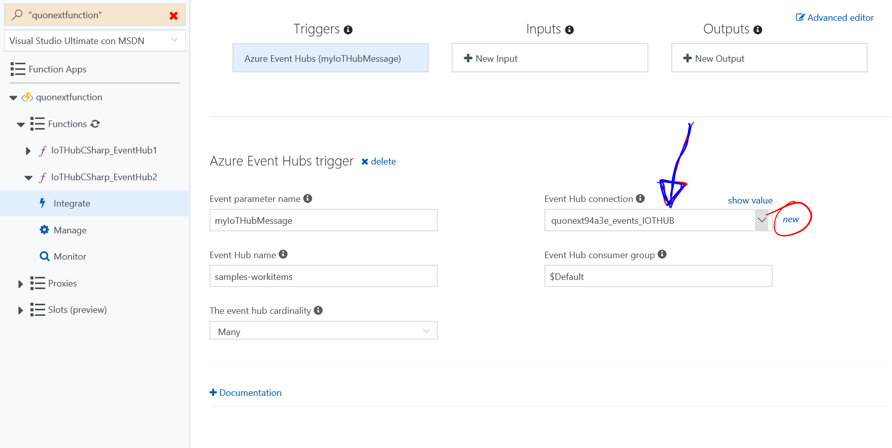

Select the IoT Hub:

Be sure you wrote the right  **consumer group**:
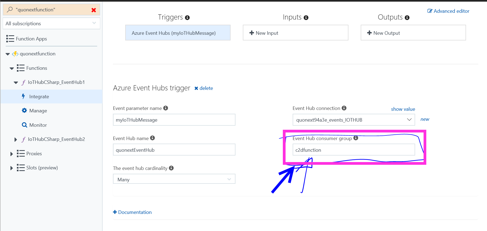
