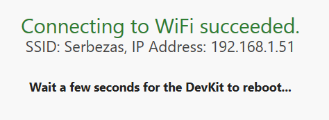
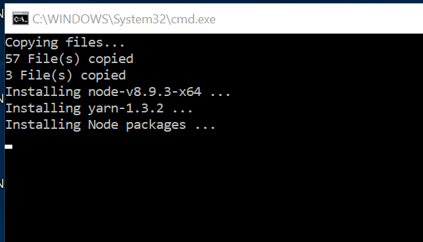
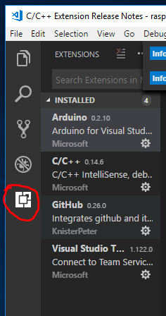

# MXChip – Basics (Get Started)

Notes from:
https://microsoft.github.io/azure-iot-developer-kit/docs/get-started/

1. Connect the MXChip board to the PC through the Micro-USB cable

2. WiFi configuration: 		
        
    a. Hold down button B – press reset – release button B
    
    b. Connect the PC to the WiFi with the SSID that appears in the screen
    
    c. Go to the IP that appears in the screen

    d.Configure the WiFi connection

    
    

3. Upgrade the firmware   
Only the 1st time-  
(guide: https://microsoft.github.io/azure-iot-developer-kit/docs/firmware-upgrading/ )  -> just copy & paste a file!

4. Development environment

    a. You need all this tools:

        • Node.js** and Yarn: Runtime for the setup script and automated tasks.
		• Azure CLI 2.0 MSI - Cross-platform command-line experience for managing Azure resources. The MSI contains dependent Python and pip.
		• Visual Studio Code (VS Code): Lightweight code editor for DevKit development.
		• Visual Studio Code extension for Arduino: Extension that enables Arduino development in Visual Studio Code.
		• Arduino IDE: The extension for Arduino relies on this tool.
		• DevKit Board Package: Tool chains, libraries, and projects for the DevKit
        •  ST-Link Utility: Essential tools and drivers.

Or... easier... download this zip with everything:  
[Installation Package 1.3.0 for Windows](https://azureboard2.azureedge.net/prod/windows/devkit_install_win_1.3.0.40.zip).  
(get the last one!)

Click-> install.cmd  +drivers

**Be sure about update/install all the extensions in VSCode:** 

**Plug** the board **after** open VSCode

### More Configuration 
(optional)

Connect with putty or filezilla and access to the configuration menu:
https://microsoft.github.io/azure-iot-developer-kit/docs/use-configuration-mode/

* Putty -> Serial, COM *X?*, 115200
* Hold down A + reset + release A Button --> configuration console shown

**Important**
set_az_iothub: set_az_iothub [device connection string]

Set device connection string for Azur IoT Hub. View [Understand Different Connection Strings in Azure IoT Hub](https://blogs.msdn.microsoft.com/iotdev/2017/05/09/understand-different-connection-strings-in-azure-iot-hub/) to learn more.
		

That's all!!

See the project you can run in your MXChip: https://microsoft.github.io/azure-iot-developer-kit/docs/projects/

