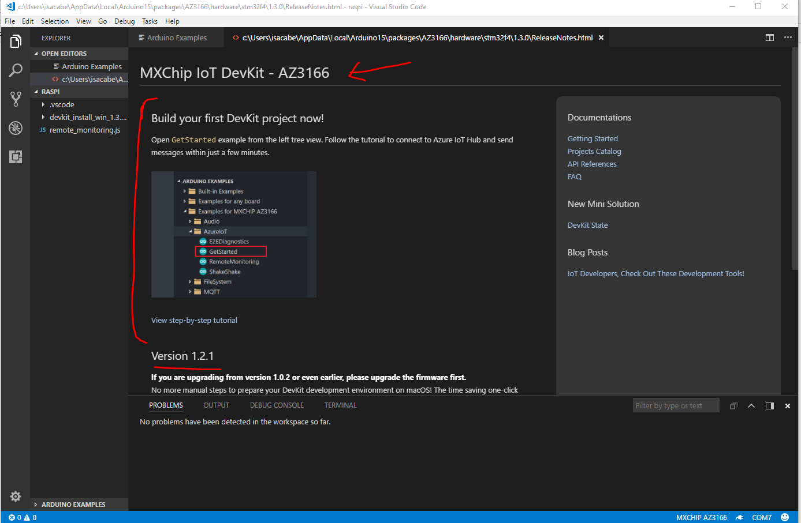

# How to install an app in your MXChip?

1. Open your VS Code:
2. Connect the IoT DevKit.   
Then 
(only then, when you've already connected the MXChip)  
VSCode detect you have MXCHip IoT DevKit installed.   
(Open: **Ctrl+Shift+P**)

**Ctrl + P**

write: 

    > task cloud-provision
    > task device-upload

Continue reading [Install connect-iot-hub app](mx_chip_iothub.md)