# Connect MXChip with IoT Hub

Let's install an application example and learn how to connect to Azure IoT Hub   (https://microsoft.github.io/azure-iot-developer-kit/docs/projects/connect-iot-hub/)

Open Get Started project: 

## 1. Ctrl + P     <-  Task cloud-provision

		
Provisioning the required Azure services:

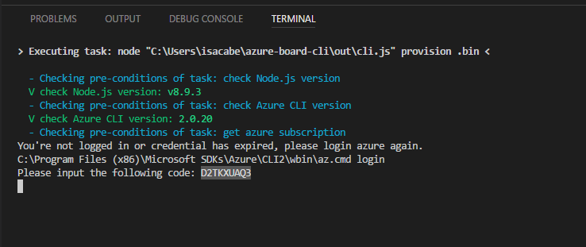

Login on the device:

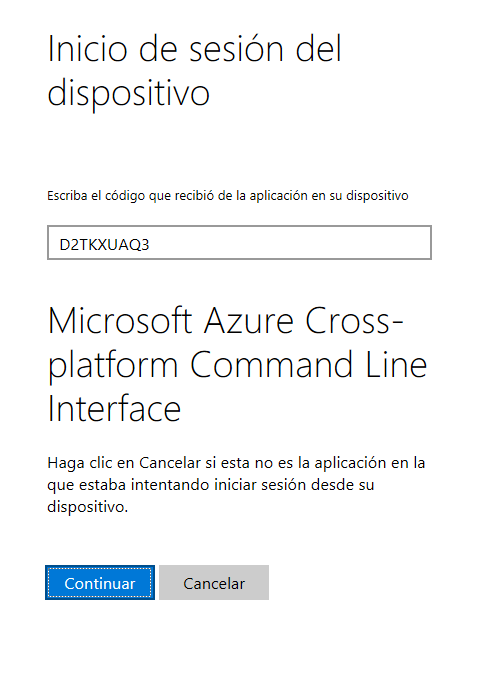

Successfully login:

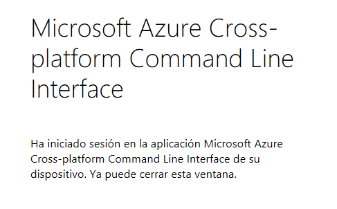

Select a subscription:

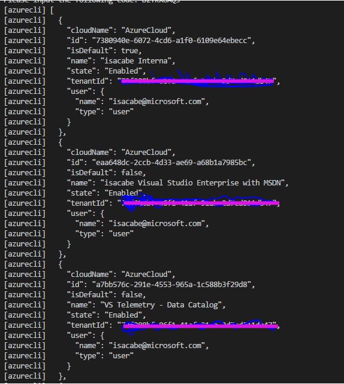

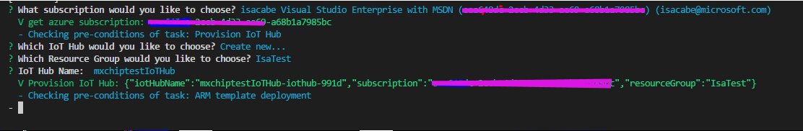

Select the IoT Hub (remember!! copy your OWN connection string!!)

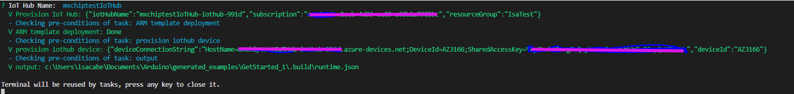

## 2. Ctrl + P <- task device-upload	
(the terminal ask you enter en configuration mode with button A + reset)

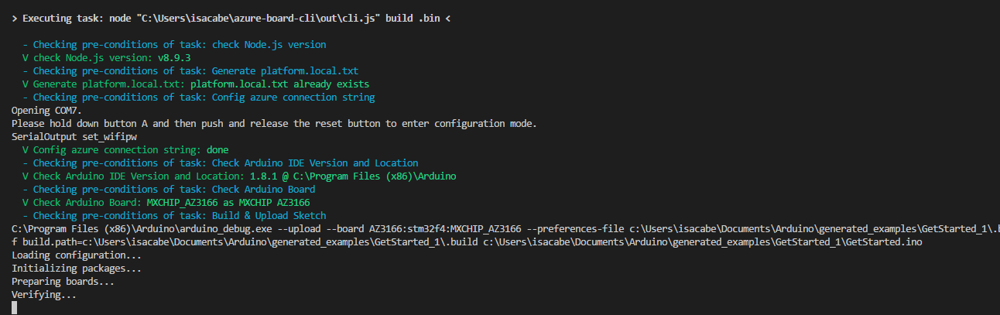
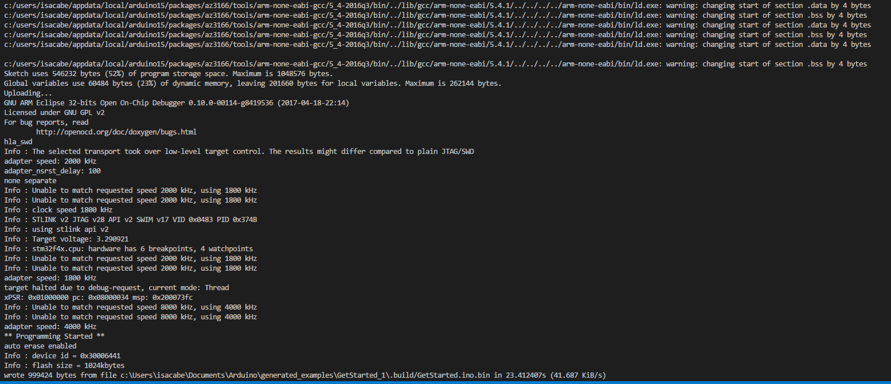
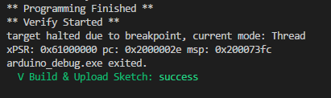

### TEST
A icon with the "COM" appears in Visual Studio Code.
Select the port:

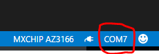

click in the "plug" icon.
choose 115200:

Look the terminal. The result should be "IOTHUB_CLIENT_CONFIRMATION_OK

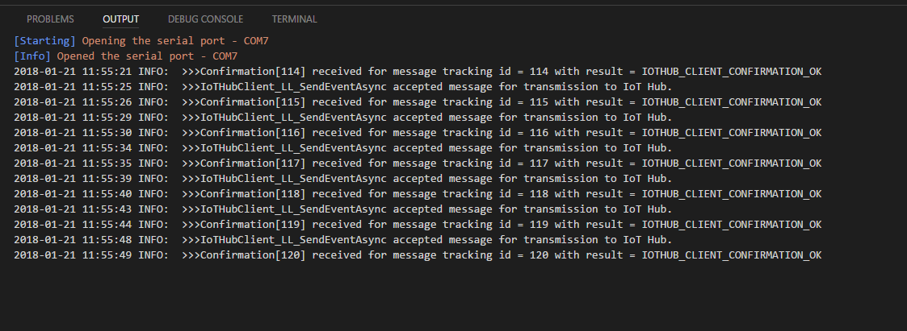

Now let's See your sent data.
(Install if you don't have it yet this extension: Azure IoT Toolkit) 
Open Azure IoT Toolkit (VS Extension)

Start  Monitoring  D2C message -> 

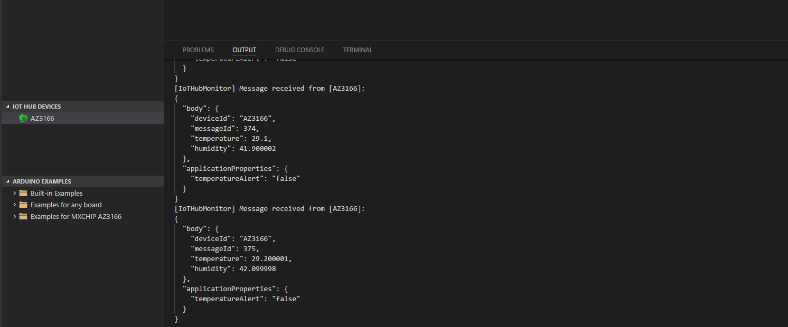

### Other interesting links (offical documentation)

To continue getting started with Azure IoT Hub and to explore other IoT scenarios, see:
	• [Manage cloud device messaging with iothub-explorer](https://docs.microsoft.com/en-us/azure/iot-hub/iot-hub-explorer-cloud-device-messaging)
    
	• [Save IoT Hub messages to Azure data storage](https://docs.microsoft.com/en-us/azure/iot-hub/iot-hub-store-data-in-azure-table-storage)

	• [Use Power BI to visualize real-time sensor data from Azure IoT Hub](https://docs.microsoft.com/en-us/azure/iot-hub/iot-hub-live-data-visualization-in-power-bi)

    
	• [Use Web Apps to visualize real-time sensor data from Azure IoT Hub](https://docs.microsoft.com/en-us/azure/iot-hub/iot-hub-live-data-visualization-in-web-apps)

	• [Weather forecast using the sensor data from your IoT hub in Azure Machine Learning](https://docs.microsoft.com/en-us/azure/iot-hub/iot-hub-weather-forecast-machine-learning)

	• [Device management with iothub-explorer](https://docs.microsoft.com/en-us/azure/iot-hub/iot-hub-device-management-iothub-explorer)

	• [Remote monitoring and notifications with ​​Logic ​​Apps](https://docs.microsoft.com/en-us/azure/iot-hub/iot-hub-monitoring-notifications-with-azure-logic-apps) 
