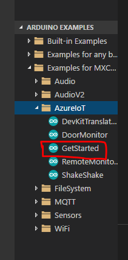

# Connect MXChip with IoT Hub

Let's install an application example and learn how to connect to Azure IoT Hub   (https://microsoft.github.io/azure-iot-developer-kit/docs/projects/connect-iot-hub/)

Open Get Started project: 

## 1. Ctrl + P     <-  Task cloud-provision

		
Provisioning the required Azure services:

Login on the device:

Successfully login:

Select a subscription:

Select the IoT Hub (remember!! copy your OWN connection string!!)

## 2. Ctrl + P <- task device-upload	
(the terminal ask you enter en configuration mode with button A + reset)

