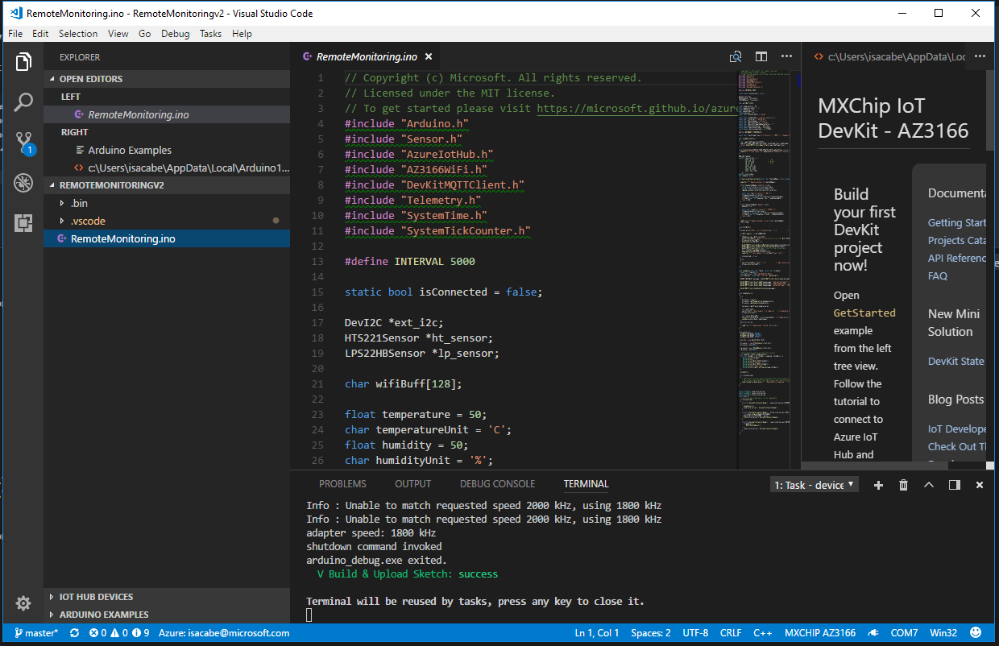
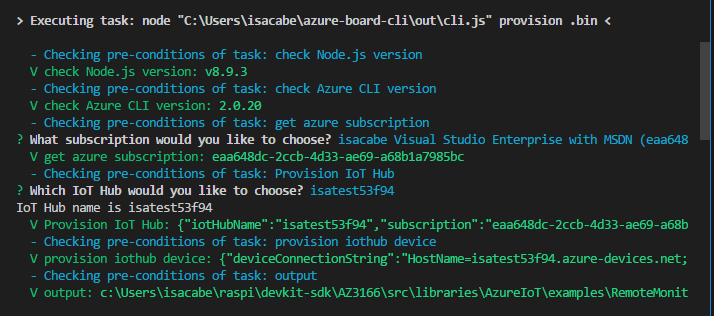

# Connect MXChip and Remote Monitoring V2

Clone the example repository: https://github.com/jmservera/devkit-sdk/tree/master/AZ3166/src/libraries/AzureIoT/examples/RemoteMonitoringv2  

Browser to >devkit-sdk\AZ3166\src\libraries\AzureIoT\examples\RemoteMonitoringv2 
and open RemoteMonitoring.ino 

### Ctrl+P  <  task cloud-provision

Choose the IoT Hub of your Remote Monitoring V2 installed in your subscription.

### Ctrl+P  <  task device-upload