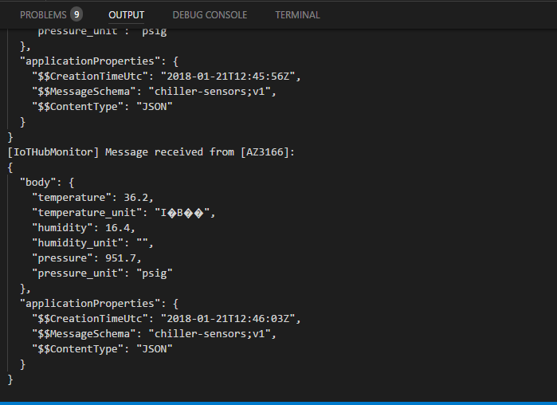

# Connect MXChip and Remote Monitoring V2

Clone the example repository: https://github.com/jmservera/devkit-sdk/tree/master/AZ3166/src/libraries/AzureIoT/examples/RemoteMonitoringv2  

Browser to >devkit-sdk\AZ3166\src\libraries\AzureIoT\examples\RemoteMonitoringv2 
and open RemoteMonitoring.ino 

### Ctrl+P  <  task cloud-provision

Choose the IoT Hub of your Remote Monitoring V2 installed in your subscription.

### Ctrl+P  <  task device-upload
(when the terminal ask it, press&hold buttonA, reset, release buttonA)

Continuing.... and Success!!

Now you can see a new device in the list:

And NOW we are sending data to the cloud!!

If you browse to your Remote Monitoring portal, now you can see the device in the map (the coordinates in the repo are from Madrid)

