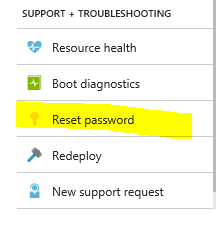
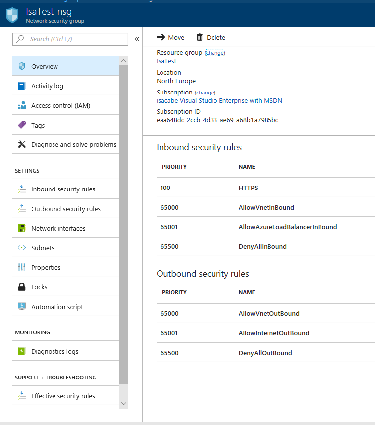
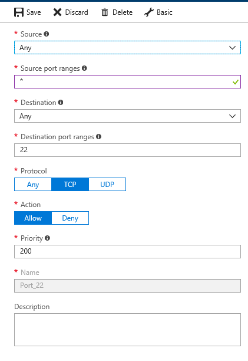
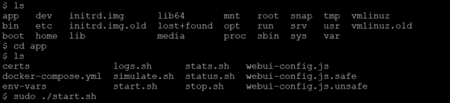
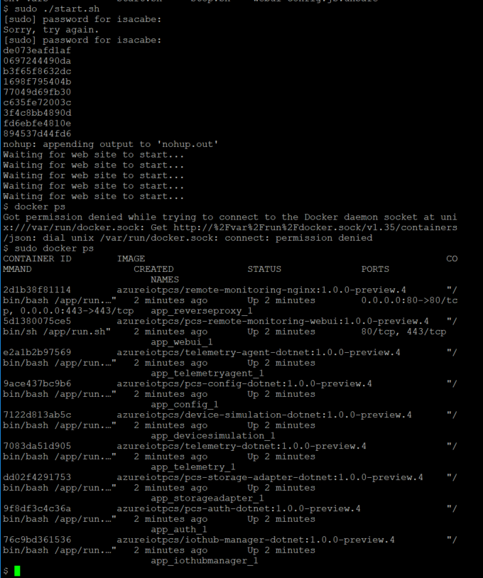
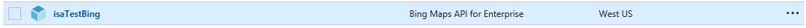
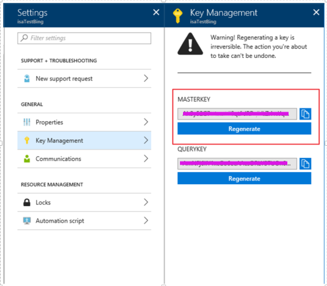

# Remote Monitoring

## How to start all the services after restarting the machine

Access to the VM, and run the script app/start.sh

But before access to the VM, the first time, you need:

### a) to change the VM password

### b) to open 22 port in the Network Security Group:

#### Access to the VM (with putty, for example)

There is an /app folder in the VM, just run the command	
*sudo ./start.sh*

Then you can check if everything is running with the command
*sudo docker ps*

## Adding Bing Map

### 1) Get a Bing Map Key

You can get one creating a service in your Azure account "Bing Maps API for Enterprise"

Or follow this instructions: https://msdn.microsoft.com/library/ff428642.aspx

### 2) Put the key in the file "env-vars" 
	
	• Open a SSH into your VM (I did it with Putty)
	• Navigate to "/app" folder and edit the file env-vars
        > sudo nano env-vars
	• Edit the line:    export PCS_BINGMAP_KEY="static" (instead "static" put your Key)
	• Restart the service with 
        > sudo ./start.sh